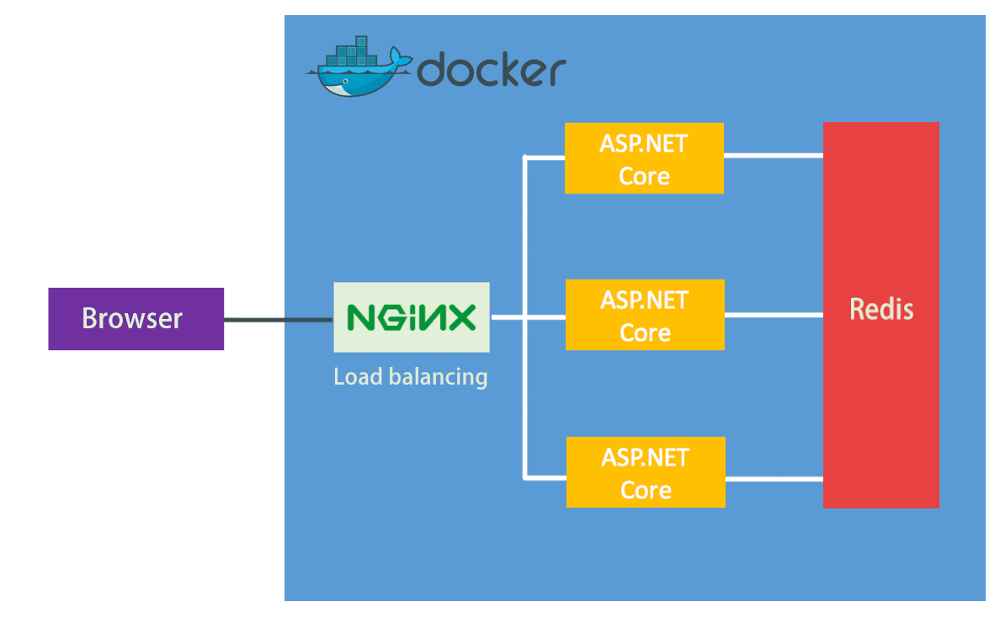

# Dockerize AspNetCore Samples


## Quick Start
```
git clone https://github.com/esofar/dockerize-aspnetcore-samples.git
cd dockerize-aspnetcore-samples
docker-compose up -d
```

## Test
```
curl http://localhost/api/hello
curl http://localhost/api/hello
curl http://localhost/api/hello

// Output:

Hello from Docker Container：172.30.0.2
Hello from Docker Container：172.30.0.4
Hello from Docker Container：172.30.0.5
```

```
curl http://localhost/api/hello/esofar

// Output:

Hello esofar form Redis
```

